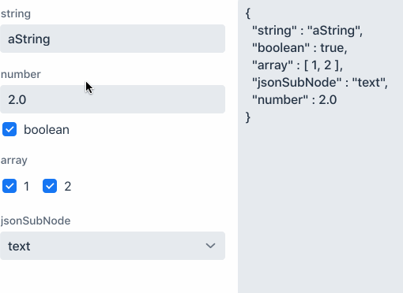

= Json binding

_PropertySet / Binder / Validator_ for https://fasterxml.github.io/jackson-databind/javadoc/2.7/com/fasterxml/jackson/databind/JsonNode.html[JsonNode].

== Usages

Reading / Writing
[source,java]
----
NumberField number = new NumberField();
JsonBinder binder = new JsonBinder();
binder.forField(number).bind("number");
binder.setBean(objectMapper.readTree("{\"number\" : \"2.0\"}));
----

Json schema validation

Is using https://json-schema.org/implementations.html[networknt/json-schema-validator].

[source,java]
----
binder.withValidator(new JsonValidator(
        JsonSchemaFactory.builder(
                JsonSchemaFactory.getInstance(SpecVersion.VersionFlag.V7))
                .build()
                .getSchema("{\"required\": [\"number\"]}")
        )
);
Label statusLabel = new Label();
binder.setStatusLabel(statusLabel);
----

== Source code
https://github.com/rkovarik/vaadin-json-binding[Github]